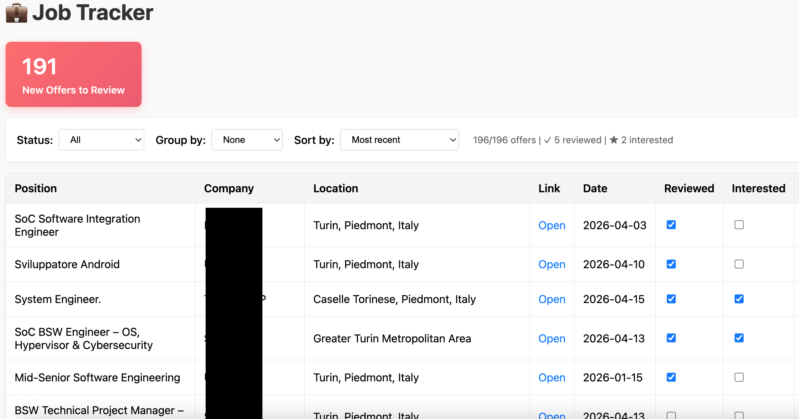

# JobsScraper — Job Offer Tracker



A simple LAN-accessible webapp to search and track job offers from various portals, with a responsive web dashboard.

⚠️ **Vibe-Coded Project**

This app was created one evening out of sheer frustration with LinkedIn's job search. You know the feeling: you spend hours scrolling through job listings, but LinkedIn keeps pushing only the sponsored/highlighted ones in your face. The filters are terrible, you can't really keep track of what you've already analyzed, and there's no way to organize your search properly.

So I built this as a personal tool to:
- Automatically scrape jobs with keywords YOU care about
- Actually track what you've reviewed vs. what interests you
- Keep notes on each offer
- Sort and filter your way

It's rough around the edges, not production-ready, and likely full of bugs. But it works for what I needed. Use at your own risk! 😅

**P.S.** This README is also vibe-coded. No fancy documentation, just honest explanations of what works and what doesn't.

⚠️ **Legal Notice**

This is a **personal tool** for my own job search, not a commercial service. The default polling interval is intentionally set high (`60 minutes`) to be respectful to the target portals. If you modify the defaults to use lower intervals, you do so at your own risk and are responsible for any consequences (rate limiting, IP bans, account suspension, etc.). Respect the Terms of Service of any website you scrape from. The author assumes no liability for misuse of this tool.

## 📋 Features

- **Automatic scraping** from LinkedIn (extensible to other portals)
- **Web dashboard** with filtering, sorting, and grouping
- **Review tracking** (mark as reviewed/interested)
- **Personal notes** on each offer
- **LAN accessible** from any device on your network
- **Web-based settings** to change configuration without restarting
- **Dark mode** toggle in settings
- **Smart defaults** - filters by "Not reviewed", groups by "Company"
- **Rate limit handling** with exponential backoff retry logic
- **Simple CLI** for management

## 🗂️ Project Structure

```
JobsScraper/
├── app.py                 # Flask app + scheduler
├── config.yaml            # Configuration (keywords, locations, scrapers, interval)
├── storage.py             # SQLite database management
├── requirements.txt       # Python dependencies
├── README.md              # This file
├── manage.py              # CLI management tool
├── scrapers/              # Scraper package
│   ├── __init__.py
│   └── linkedin.py        # LinkedIn scraper (plugin)
└── templates/
    └── index.html         # Web UI (table, flag, comments)
    └── settings.html      # Web UI (settings)
```

## 🚀 Quick Start

### 1️⃣ Clone / Download the project

If you haven't already, download the project and navigate to the folder:

```bash
cd /path/to/JobsScraper
```

### 2️⃣ Create virtual environment (first time only)

```bash
python3 -m venv venv
```

### 3️⃣ Install dependencies

```bash
python3 manage.py install
```

This automatically installs:
- `Flask` — web framework
- `requests` — HTTP client
- `beautifulsoup4` — HTML parsing
- `apscheduler` — task scheduler
- `PyYAML` — YAML config parsing


### 4️⃣ Start the app

**Option A: Foreground (see logs)**
```bash
python3 manage.py start
```

Output:
```
🔍 Running scrapers...
✓ Inserted/updated 186 new jobs (scraped 251 total)

============================================================
✅ JobsScraper is RUNNING
============================================================
📱 Web UI: http://127.0.0.1:5000
   or from other machines: http://<YOUR_IP>:5000
   (Find your IP: ifconfig | grep 'inet ')
============================================================
```

👆 **The app is ready when you see this banner!**

**Option B: Background**
```bash
python3 manage.py start --bg
```

### 5️⃣ Access the UI

- **Same machine**: http://127.0.0.1:5000
- **Other PC on LAN**: http://<YOUR_IP>:5000

The dashboard shows a table with all jobs. You can:

| Feature | How |
|---------|-----|
| **Filter by Status** | Use "Status" dropdown (All / Reviewed / Interested / Not reviewed) |
| **Filter by Keyword** | Use "Keyword" dropdown to show only jobs found with specific keywords |
| **Group** | Use "Group by" dropdown (None / Company / Posted Date) |
| **Sort** | Click column headers (Position, Company, Location, Date) |
| **Mark Reviewed** | Check ✓ checkbox (auto-saves to DB) |
| **Mark Interested** | Check ★ checkbox (auto-saves to DB) |
| **Add Notes** | Click "Comment" field, type, then click outside to save |

**Smart Defaults**: Dashboard opens with "Not reviewed" filter and "Company" grouping for quick scanning.

**Keyword Tags**: Each job tracks which keywords it was found with. This lets you:
- Filter results to see only jobs matching a specific keyword search
- Understand which of your searches are producing results
- Re-verify jobs if you modify your keyword list

Click **⚙️ Settings** button to access the configuration panel:

1. **Keywords** - Add/remove search terms (press Enter)
2. **Locations** - Add/remove job locations (press Enter)
3. **Polling Interval** - Minutes between scraping cycles (default: 60)
4. **Scrapers** - Enable/disable available scrapers
5. **Dark Mode** - Toggle dark/light theme (saved in browser)

Changes apply on the **next scraping cycle**. No app restart needed!

Edit `config.yaml` directly for advanced options:

```yaml
debug_level: 1                   # 0=silent, 1=normal, 2=verbose, 3=debug

scrapers:
  - name: linkedin
    module: scrapers.linkedin
    class: LinkedInScraper
    enabled: true
    max_results_per_search: 1000
```

**Note**: Only edit `config.yaml` directly to:
- Change `debug_level` (requires app restart)
- Add new scrapers (requires app restart)
- Adjust `max_results_per_search` per scraper

For keywords, locations, polling interval, and scraper enable/disable, **use the Web Settings** instead!

### 6️⃣ Adding a New Scraper

### Example: Indeed Scraper

1. Create `scrapers/indeed.py`:

```python
import requests
from bs4 import BeautifulSoup
import time

class IndeedScraper:
    def search(self, keywords: str, location: str, max_results: int = 100) -> list:
        all_jobs = []
        url = f"https://www.indeed.com/jobs?q={keywords}&l={location}"
        headers = {
            'User-Agent': 'Mozilla/5.0 (..)'
        }
        try:
            resp = requests.get(url, headers=headers, timeout=10)
            soup = BeautifulSoup(resp.text, 'html.parser')
            # Parse Indeed-specific HTML...
            # Return list of dicts with keys: title, company, location, url, posted_date
        except Exception as e:
            print(f"Error: {e}")
        return all_jobs
```

2. Add to `config.yaml`:

```yaml
scrapers:
  - name: linkedin
    module: scrapers.linkedin
    class: LinkedInScraper
    enabled: true
  - name: indeed
    module: scrapers.indeed
    class: IndeedScraper
    enabled: true
```

3. Restart `app.py`.

## 📊 Database File

- `jobs.db` — SQLite database (created automatically on first run)
  - Table: `jobs` (id, title, company, location, url, posted_date, flag, comment, created_at)

To inspect the DB directly:
```bash
sqlite3 jobs.db "SELECT COUNT(*) as total FROM jobs;"
```

To reset the database:
```bash
rm jobs.db
```

##  Troubleshooting

### "ModuleNotFoundError: No module named 'flask'"

Make sure you've installed dependencies:
```bash
python3 manage.py install
```

### "Connection refused" when accessing from smartphone

- Verify the app is running: `http://127.0.0.1:5000` should work on the PC.
- Verify firewall doesn't block port 5000.
- Verify smartphone is on the same WiFi network.
- Use `ifconfig | grep "inet "` to find the correct IP (usually `192.168.x.x`).

### "LinkedIn blocked (403)" or "Too Many Requests (429)"

LinkedIn rate limits aggressive scraping. The app now includes **exponential backoff retry logic** that automatically:
- Detects 429 (Too Many Requests) responses
- Waits with increasing delays (10s → 20s → 40s)
- Retries up to 3 times before giving up

**If you still hit limits:**
- Increase the polling interval to `60` or higher (default is safe)
- Reduce `max_results_per_search` per scraper (fewer jobs per cycle)
- Add more locations/reduce keywords to spread load
- Use proxy or VPN
- Add scrapers for other portals (Indeed, Glassdoor, etc.)

### No offers found

- Check that keywords and locations in `config.yaml` are correct.
- Check app logs for scraping errors.
- Try changing LinkedIn site language (EN vs IT).

##  License

**MIT License** — You're free to use, modify, and distribute this software. Just keep my name in the credits. That's it!

For the full legal text, see [LICENSE](./LICENSE).

---

**Good luck with your job search! 🚀**
